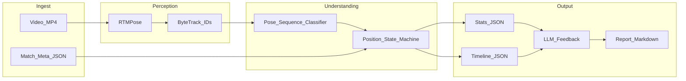

# BJJ Analyst — Softwarearchitektur (No-Gi, CLI)

Leitfaden für den Start der Entwicklung. Scope: **Offline-Analyse**, **No-Gi**, Auslieferung zuerst als **CLI** (Video rein → strukturierte Analyse + Feedback-Report raus).

---

## 1. Ziel

Aus einem Match-/Sparringsvideo ableiten:

- angewandte Techniken / Events **mit Timestamps**
- Guard- und Positionsanteile (Dauer, Häufigkeit)
- Übergänge, die zu einer **besseren Position** führen
- am Ende einen **Coach-/Scout-Report** (LLM auf Fakten, nicht auf Rohvermutung)

Nicht im MVP: Live-Streaming, Web-UI, Gi-spezifische Grips, Multi-Kamera-Fusion.

---

## 2. Architekturübersicht



**Arbeitsteilung (Kernprinzip):**

| Schicht | Wahrheit liefert | Darf nicht |
|---------|------------------|------------|
| Pose + Track | Wer wo, wann (Keypoints) | Techniknamen „raten“ |
| Temporales Modell | Guard/Position/Event-Kandidaten | finale Statistik erfinden |
| State Machine | Dauern, %, Transitions, Timestamps | Prosa schreiben |
| LLM | Erklärung + Feedback | eigene Timestamps/Prozente erfinden |

---

## 3. Pipeline-Stufen (Aufgaben + Technologie)

### 3.1 CLI & Orchestrierung

**Aufgabe:** Ein Befehl steuert die ganze Offline-Pipeline und schreibt Artefakte in einen Run-Ordner.

**Technologie:** Python 3.11+, `typer` oder `argparse`, Konfiguration per YAML.

**Einsatz:**

```bash
bjj-analyst analyze path/to/match.mp4 --out runs/2026-08-13_match01 --meta meta.json
```

Erzeugt z. B.:

```text
runs/2026-08-13_match01/
  poses.parquet          # Keypoints + track_id pro Frame
  timeline.json          # Zustände & Events mit Timestamps
  stats.json             # Aggregate
  report.md              # LLM-Feedback
  debug/                 # optionale Overlays, Fehlersamples
```

---

### 3.2 Video-Ingest

**Aufgabe:** Video lesen, FPS/Auflösung normieren, Frame-Index → Zeit (`t = frame / fps`).

**Technologie:** OpenCV oder Decpeg-python; einheitliche Analyse-FPS (z. B. 15–25 FPS) fürs MVP.

**Einsatz:** Alle späteren Module arbeiten auf Frame-Index + `fps`, nie auf „ungefähren Sekunden“ aus dem LLM.

---

### 3.3 Athleten-Pose: RTMPose

**Aufgabe:** Pro Frame 2D-Skelette der Athleten schätzen (Gelenke: Hüfte, Knie, Schulter, Ellbogen, Handgelenk, …).

**Technologie:** [RTMPose](https://github.com/open-mmlab/mmpose) (MMPose / RTMLib). Leichtgewichtig, gut für Sport/Offline-Batch.

**Einsatz:**

- Input: Frame
- Output: Liste von Personen mit Keypoints + Konfidenz
- No-Gi Vorteil: Körperkonturen klarer als im Gi; Grips an Stoff entfallen als Label-Ziel

**Grenze:** Pose allein kennt keine „Butterfly Guard“. Sie liefert nur Geometrie für die nächsten Stufen.

---

### 3.4 Tracking: ByteTrack (oder OC-SORT)

**Aufgabe:** Dieselbe Person über Frames hinweg als `track_id` halten; Rollen `athlete_a` / `athlete_b` zuweisen.

**Technologie:** ByteTrack auf Person-Boxen (aus YOLO-Detektor vor RTMPose, oder Boxen aus dem Pose-Top-Down-Detector).

**Einsatz:**

- Stabilisiert Pose-Sequenzen pro Athlet
- Ermöglicht relative Features: Distanz Hüfte–Hüfte, wer oben/unten, wer Rücken zum Boden

**MVP-Regel:** Manuell in `meta.json` festlegen, welche `track_id` Athlete A/B ist (oder erstes Frame anklicken / kurze CLI-Hilfe). Automatische „Wer ist wer“-Erkennung kommt später.

---

### 3.5 Feature-Builder (Pose → Sequenz)

**Aufgabe:** Aus zwei Track-Skeletten fensterweise Features bauen, die ein temporales Modell versteht.

**Technologie:** NumPy/PyTorch; gleitende Fenster z. B. **2.0 s Länge, 0.5 s Hop** (bei 20 FPS ≈ 40 Frames, Stride 10).

**Typische Features (No-Gi):**

- normalisierte Keypoints beider Athleten (Hüft-zentriert, Schulterbreite skaliert)
- Relationen: Abstand, Orientierung Torso, wer höher (Mount/Side-Indiz)
- Konfidenz-Masken (verdeckte Gelenke)

**Einsatz:** Jedes Fenster wird ein Sample für Klassifikation — nicht der ganze Fight auf einmal.

---

### 3.6 Temporales Modell (Technik & Position)

**Aufgabe:** Pro Fenster vorhersagen:

1. **Position/Guard-Zustand** (primär für Stats)
2. **Event** (optional, seltenere Klassen: Pass, Sweep, …)

**Technologie (festgelegt für MVP):** **Pose-Sequenz-Klassifikator** auf Graph/Transformer-Basis (z. B. ST-GCN-Variante oder kleiner Transformer auf Keypoint-Sequenzen). Training in PyTorch.

**Warum nicht Rohvideo-SlowFast zuerst?** Weniger Datenhunger, robuster gegen Kamerawinkel-Varianz im MVP, passt zu RTMPose-Output. Video-Backbone kann später als zweite Opinion kommen.

**No-Gi Label-Set (MVP, eng halten):**

**Zustände (State):**

| ID | Bedeutung |
|----|-----------|
| `standing` | beide stehend / Clinch ohne klare Bodenkontrolle |
| `open_guard` | Guard ohne geschlossene Beine, inkl. generischem Open |
| `closed_guard` | Beine geschlossen um Torso |
| `half_guard` | ein Bein des Passers eingefangen |
| `butterfly` | Butterfly-Hooks |
| `side_control` | Side Control |
| `mount` | Mount |
| `back_control` | Back mit Hooks / Körperkontrolle |
| `north_south` | North-South |
| `turtle` | Turtle |
| `other_ground` | Rest / unklar |

**Events (punktuell, am Fensterende oder Transition):**

| ID | Bedeutung |
|----|-----------|
| `takedown` | Stand → Boden mit Vorteil |
| `pass` | Guard → stabile Pass-Position |
| `sweep` | Guard-Spieler dreht zu Top |
| `reversal` | Bottom ohne klassischen Guard-Sweep zu Top |
| `submission_attempt` | klare Finish-Absicht (RNC, Armbar, Triangle, Leg Lock …) |
| `submission_finish` | Tap / Referee-Stop (wenn erkennbar / Meta) |
| `none` | kein Event in diesem Fenster |

**Einsatz:** Modell-Output = Wahrscheinlichkeiten pro Fenster. Die State Machine glättet und entscheidet endgültig.

---

### 3.7 State Machine & Statistik

**Aufgabe:** Aus Fenster-Vorhersagen eine konsistente Timeline und Aggregate bauen.

**Technologie:** Deterministische Python-Logik (keine ML-Blackbox). Optional HMM-Glättung später; MVP: Mehrheitsvote + Mindest-Dauer.

**Regeln (Beispiele):**

- Zustand wechselt erst nach ≥ **0.8–1.0 s** Stabilität (Anti-Flackern)
- Event wird nur übernommen, wenn Modell-Konfidenz ≥ Schwellwert **und** Zustandsübergang passt (z. B. `sweep` nur Guard→Top)
- „Bessere Position“ über eine **hierarchische Positionsordnung** (No-Gi), z. B.:

```text
back_control > mount > side_control / north_south > half_pass_advantage
  > open/closed/butterfly (Bottom-Guard) > turtle > standing (kontextabhängig)
```

Aus Sicht von Athlete A: Transition zählt als positiv, wenn `rank(position_after) > rank(position_before)` für A.

**Outputs:**

- `timeline.json`: Abschnitte `{start_s, end_s, state, top_athlete, ...}` + Events `{t_s, type, by_athlete}`
- `stats.json`: Guard-Anteile %, Pass-/Sweep-Counts, erfolgreiche Positionsverbesserungen, Heatmap der Übergänge (From→To Matrix)

---

### 3.8 Feedback: LLM (nicht VLM im MVP)

**Aufgabe:** Lesbaren Analysten-Report erzeugen: Zusammenfassung, Muster, Drill-Empfehlungen.

**Technologie:** LLM per API (z. B. OpenAI/Anthropic-kompatibel) oder lokales Modell; Prompt fest versioniert.

**Einsatz:** Prompt enthält **nur**:

- `stats.json` (Fakten)
- `timeline.json` (gekürzt / salient events)
- Match-Meta (Gürtel, Regelset ADCC-ähnlich / IBJJF No-Gi, wer gewinnt — falls bekannt)

Explizite Prompt-Regel: *Keine Timestamps oder Prozente erfinden; nur gegebene Zahlen verwenden.*

**Warum LLM statt VLM zuerst?** Stats und Timeline sind bereits strukturiert; VLM würde ohne Zwang wieder halluzinieren. VLM-Clip-Kommentare sind Phase 2.

---

### 3.9 Artefakte & Qualitätssicherung

**Aufgabe:** Jeden Lauf reproduzierbar und debuggbar machen.

**Technologie:** JSON Schema für Timeline/Stats; optionale Pose-Overlay-Videos mit OpenCV.

**Einsatz:** Bei Fehlern erst Timeline vs. Video prüfen, dann Modell — nicht am Report drehen.

---

## 4. Datenverträge (MVP)

### 4.1 `meta.json`

```json
{
  "sport": "bjj_nogi",
  "athlete_a": "Name A",
  "athlete_b": "Name B",
  "track_id_a": 1,
  "track_id_b": 2,
  "ruleset": "nogi_general"
}
```

### 4.2 `timeline.json` (Ausschnitt)

```json
{
  "fps": 20,
  "segments": [
    {"start_s": 12.0, "end_s": 41.5, "state": "closed_guard", "bottom": "a", "top": "b"}
  ],
  "events": [
    {"t_s": 41.5, "type": "sweep", "by": "a", "from": "closed_guard", "to": "mount"}
  ]
}
```

### 4.3 `stats.json` (Ausschnitt)

```json
{
  "athlete_a": {
    "time_in_state_s": {"closed_guard_bottom": 120.0, "mount_top": 35.0},
    "events": {"sweep": 2, "pass": 1, "submission_attempt": 3},
    "position_improvements": [
      {"t_s": 41.5, "from": "closed_guard_bottom", "to": "mount_top", "via": "sweep"}
    ]
  },
  "transition_matrix": {"closed_guard": {"mount": 2, "side_control": 1}}
}
```

---

## 5. Empfohlene Repo-Struktur

```text
bjj_analyst/
  ARCHITECTURE.md          # dieses Dokument
  README.md
  pyproject.toml
  configs/
    labels_nogi.yaml       # State-/Event-Taxonomie + Rankings
    pipeline_default.yaml
  src/bjj_analyst/
    cli.py                 # Entry: analyze, doctor, report-only
    ingest/
      video.py
    pose/
      rtmpose_runner.py
      tracking.py
    features/
      windowing.py
      pose_features.py
    temporal/
      dataset.py
      model.py
      infer.py
      train.py
    state_machine/
      positions.py
      machine.py
      stats.py
    feedback/
      prompt.py
      llm_report.py
    schemas/
      timeline.schema.json
      stats.schema.json
  tests/
    test_state_machine.py
    test_windowing.py
```

---

## 6. Entwicklungsreihenfolge (konkrete Aufgaben)

### Phase 0 — Gerüst

1. Python-Paket + CLI-Stub `analyze` / `report`
2. `labels_nogi.yaml` + JSON-Schemas
3. State Machine **ohne ML** mit synthetischen/manuellen Segmenten → Stats testen

### Phase 1 — Perception

4. Video laden, FPS/Timestamps
5. RTMPose-Batch-Inferenz → `poses.parquet`
6. ByteTrack + manuelle A/B-Zuordnung in Meta
7. Debug-Overlay (Skelette + IDs)

### Phase 2 — Verständnis

8. Windowing + Pose-Features
9. Kleines gelabeltes No-Gi-Set (zuerst **nur Zustände**, 10 Klassen)
10. Temporales Modell trainieren / evaluieren (Frame-/Fenster-Accuracy, Confusion Matrix)
11. Events als zweite Head oder separates Modell, sobald Zustände stabil sind

### Phase 3 — Produktive Analyse

12. State Machine an Modell-Output anbinden
13. `timeline.json` + `stats.json` schreiben
14. LLM-Report aus Fakten
15. End-to-End auf 3–5 echten No-Gi-Videos manuell reviewen

### Phase 4 — Härten (nach MVP)

16. Mehr Labels, Kalibrierung der Schwellwerte
17. Bessere Athlete-ID (Re-ID / Farbe / Jersey)
18. Optional: VLM nur für ausgewählte Event-Clips kommentieren lassen

---

## 7. Nicht-Ziele / bewusste Grenzen

- Kein Live-Scoreboard
- Kein Gi-Grip-Tracking
- Keine juristische „Referee-Entscheidung“ als Absolute
- Kein riesiges Techniklexikon (50+ Moves) im ersten Modell — sonst zerfällt die Accuracy

---

## 8. Design-Review & Validierung

### 8.1 Entspricht das den Anforderungen?

| Anforderung | Abgedeckt durch | Urteil |
|-------------|-----------------|--------|
| Techniken mit Timestamp | Temporal Events + State-Machine-Übergänge → `timeline.events[].t_s` | Ja |
| Welche Guard am meisten | `stats.time_in_state_s` aus stabilisierten Segmenten | Ja |
| Bewegungen → bessere Position | Transition + Positions-Ranking in der State Machine | Ja |
| Nicht live | Batch-CLI, Run-Ordner | Ja |
| No-Gi | Taxonomie ohne Gi-Grips; Pose-first | Ja |
| Beschreibung/Feedback | LLM auf `stats` + `timeline` | Ja |

### 8.2 Stimmt die Arbeitsteilung?

- **RTMPose** liefert Geometrie — richtig, weil No-Gi und Zustände stark körperrelativ sind.
- **Temporales Pose-Modell** statt Frame-R-CNN für Technik — richtig, weil Pass/Sweep Sequenzen sind.
- **State Machine** für Stats — richtig, weil KPIs deterministisch und testbar sein müssen.
- **LLM am Ende** — richtig, weil Prosa entkoppelt von Messwahrheit bleibt.
- **Kein VLM im MVP** — richtig für CLI-Faktenlage; vermeidet doppelte Halluzinationsquelle.

### 8.3 Risiken (akzeptiert, mitigiert)

| Risiko | Mitigation |
|--------|------------|
| Pose bricht bei Occlusion / Bodenkampf | Konfidenz-Masken; kurze manuelle Korrektur-Tools später; Fenster mit niedriger Pose-Qualität verwerfen oder als `other_ground` |
| Track-Swaps | ByteTrack + Meta A/B; Overlay-QA; bei Swap Run markieren |
| Zu viele Klassen | MVP-Taxonomie bewusst klein; Events nachziehen |
| LLM erfindet Zahlen | Prompt + nur JSON-Kontext; Report-Tests „jede Zahl muss in stats vorkommen“ |
| Domänen-Shift Kamera/Gym | Eigenes No-Gi-Labelset aus Zielumgebung; Augmentation (Crop, FPS) |

### 8.4 Architektur-Urteil

Das Design ist **schlank genug zum Starten** und **hart genug für echte Kennzahlen**:

1. Messung (Pose → Temporal → State Machine) und Erzählung (LLM) sind getrennt.
2. CLI + JSON-Artefakte erlauben schrittweises Entwickeln und Testen ohne UI.
3. No-Gi-Taxonomie ist handhabbar und deckt Guard-Anteil, Transitions und Feedback ab.
4. Die größte Unbekannte ist nicht die Softwarestruktur, sondern **Labelqualität und Menge** — Phase 0–1 können trotzdem sofort beginnen (State Machine + Pose-Pipeline), parallel zum Annotieren.

**Freigabe zum Entwickeln:** Phase 0 und 1 parallel starten; ML-Training (Phase 2) erst wenn ≥ einige hundert gelabelte Fenster für Zustände existieren. Nicht früher das Techniklexikon aufblasen.
